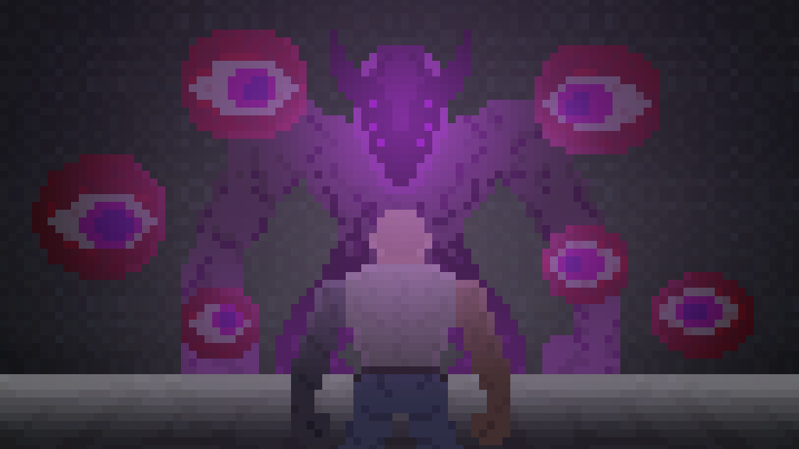

# Hello and welcome to Chad vs Alien!

## Starting the game
When you clone the project you should have The cofing UseThisConfigToRun next to the green hammer.

If this is the case you can just hit the green play button and Enjoy 

Otherwise please add a run configutation 

* This is next to your green hammer
* There select Edit configurations
* Press the plus Icon select Application
* Then select in the main Class field the Class Game.java
* the press Alt + V and the filed VM options will get added 
* there insert -XX:+UseZGC
* Then save the config and  press the green Icon
* This is just a garbage collector for helping out a bit with ram usage

## Known Problems

If you are getting errors like this while starting  

__" Cannot invoke "Woralcoholics.game.GameManager.render(java.awt.Graphics)" because "Woralcoholics.game.Game.handler" is null" or something with cannot invoke just relaunch the game and it works "__

just press run again 

## Instructions

Moving is binded to the key 

W = up \
A = left \
S = down \
D = rigth 

This is just a garbage collector for helping out a bit with ram usage
Shooting is handeld just by having the mouse in the game window and pressing left Mose button
 
More information is in the Tutorial 
